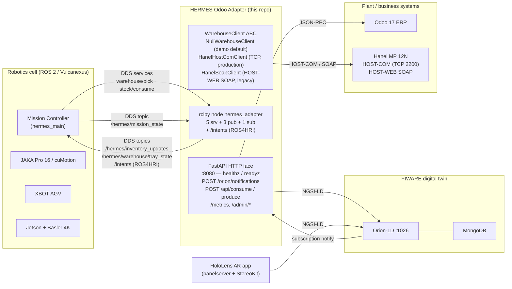

# HERMES Odoo Adapter v2.0

[](https://opensource.org/licenses/Apache-2.0)
[](https://www.python.org/)
[](https://fastapi.tiangolo.com/)
[](https://docs.ros.org/en/humble/)
[](https://vulcanexus.io/)
[](https://docs.docker.com/compose/)

A **hybrid ROS2 + FastAPI adapter** that bridges **Odoo ERP**, **FIWARE Context Brokers**, and **warehouse systems** (Hanel vertical lifts via SOAP) for smart manufacturing in the HERMES/ARISE project. Built on **Vulcanexus Humble** (eProsima Fast-DDS) for native DDS communication.

## Key Features

- **4-Protocol Hub**: Speaks DDS (ROS2/Vulcanexus), JSON-RPC (Odoo), NGSI-LD (FIWARE), and SOAP 1.1 (Hanel warehouse) from a single process
- **ROS2 Services**: Exposes warehouse pick (request / status / cancel) and stock consume / produce operations as ROS2 services over Fast-DDS
- **Warehouse Abstraction**: Pluggable backend — `HanelSoapClient` for production SOAP integration, `NullWarehouseClient` for dev/test (replaces WireMock)
- **Real-time Project Processing**: Processes manufacturing projects from NGSI-LD notifications
- **BOM Resolution**: Resolves Bills of Materials and checks component availability via Odoo
- **Bidirectional Stock Operations**: Read inventory levels AND write stock changes during missions
- **Inventory Sync**: Continuous sync between Odoo, warehouse, and FIWARE context
- **Warehouse Sync**: Article bootstrap, inbound stock detection, and inventory reconciliation with Hanel
- **Mission State Bridge**: Subscribes to `/hermes/mission_state` ROS2 topic and patches FIWARE entities (absorbs ROS-FIWARE Bridge)
- **Production Ready**: Circuit breakers, retry logic, Prometheus metrics, structured logging
- **Docker-First**: Vulcanexus Humble base image with multi-stage build

## Connection with ARISE

The adapter is the integration backbone of an **ARISE Reusable HRI
Module**: it composes the four All-in-one-middleware pillars in a
single process so a downstream Mission Controller stays simple.

| ARISE pillar | How the adapter uses it |
|---|---|
| **Vulcanexus / ROS 2** | Runs on `eprosima/vulcanexus:humble` (`vulcanexus-humble-core 2.8.0`, Fast-DDS 2.14.4). The `rclpy` node lives in a background thread inside FastAPI. Exposes 5 service servers + **4 publishers** (`/hermes/inventory_updates`, `/hermes/warehouse/tray_state` latched, `/diagnostics`, **`/intents`** — ROS4HRI) + 1 subscriber over `ROS_DOMAIN_ID=42`. |
| **FIWARE / NGSI-LD** | Owns four canonical entity types (`Project`, `Reservation`, `Shortage`, `InventoryItem`) against Orion-LD, with public JSON Schemas in [`contracts/schemas/`](contracts/schemas/) and a project-specific `@context` in [`contracts/context/`](contracts/context/). |
| **DDS-NGSI-LD integration** | In-process bridging (`ros2_node.py` ↔ `orion_client.py`). The FIWARE DDS Enabler is N/A; the canonical topic↔entity mapping is documented in [`config/README.md`](config/README.md) for any third party who wants to plug the enabler in. |
| **ROS4HRI / ROS4RI** | Publishes [`hri_actions_msgs/Intent`](https://github.com/ros4hri/hri_actions_msgs/blob/humble-devel/msg/Intent.msg) on the canonical `/intents` topic for every Odoo planner manufacturing-order event (`intent=START_ACTIVITY`, `source=erp/odoo`, `modality=MODALITY_OTHER`). |

For the full report-level narrative see
[`docs/01_arise_context.md`](docs/01_arise_context.md).

## Architecture

The adapter acts as the central hub — one process, four protocols.
GitHub renders the Mermaid diagram below inline; for tools that don't
render Mermaid, an ASCII fallback follows in the `<details>` block.



A richer Mermaid sequence-diagram set is at
[`media/sequence_diagram.md`](media/sequence_diagram.md) (Shortage flow,
Reservation top-up, Mission Controller pick).

<details>
<summary>ASCII fallback diagram</summary>

```
                         ROS2 DDS (Fast-DDS / Vulcanexus)
                    ┌──────────────┴──────────────┐
                    │                              │
                    ▼                              │
          ┌─────────────────────────────────────────────────────┐
          │            HERMES ODOO ADAPTER v2.0                 │
          │            (FastAPI + rclpy hybrid)                  │
          │                                                     │
          │  ROS2 FACE (DDS)              FastAPI FACE (:8080)  │
          │                                                     │
          │  Services:                    GET  /healthz          │
          │   /hermes/warehouse/pick      GET  /readyz           │
          │   /hermes/warehouse/status    GET  /metrics          │
          │   /hermes/warehouse/cancel    POST /orion/notifications │
          │   /hermes/stock/consume       POST /api/consume      │
          │   /hermes/stock/produce       POST /api/produce      │
          │                               GET  /admin/...        │
          │  Topics:                                            │
          │   /hermes/inventory_updates  (pub)                  │
          │   /hermes/warehouse/tray_state (pub, latched)        │
          │   /diagnostics                (pub)                  │
          │   /intents                    (pub, ROS4HRI)         │
          │   /hermes/mission_state      (sub)                  │
          │                                                     │
          │  ┌───────────┐  ┌───────────┐  ┌─────────────────┐ │
          │  │ Odoo      │  │ Orion     │  │ Warehouse       │ │
          │  │ Client    │  │ Client    │  │ Client          │ │
          │  │ (JSONRPC) │  │ (NGSILD)  │  │ HostCom/SOAP/Null│ │
          │  └─────┬─────┘  └─────┬─────┘  └───────┬─────────┘ │
          └────────┼──────────────┼─────────────────┼───────────┘
                   │              │                  │
                JSON-RPC       NGSI-LD            HOST-COM/SOAP
                   ▼              ▼                  ▼
             ┌──────────┐  ┌──────────┐      ┌──────────────┐
             │ Odoo ERP │  │ Orion-LD │      │  Hanel MP    │
             └──────────┘  └──────────┘      │  Controller  │
                                             └──────────────┘
```

</details>

## Target platforms

| Category | Tested | Expected compatibility | Unsupported |
|---|---|---|---|
| **Manipulator / cobot** | JAKA Pro 16 (×2, ASRS picking + assembly handover) | Any ROS 2-driven cobot whose driver exposes joint-trajectory + gripper interfaces — the adapter never talks to the cobot directly; the Mission Controller does. | — |
| **Mobile robot / AGV** | XBOT AGV (433 MHz / RS485 wireless) | Any AGV that exposes a docking action via ROS 2 (e.g. `nav2`). | — |
| **Industrial cell / PLC** | Hänel MP 12N HOST-COM controller (TCP telegrams) + HOST-WEB SOAP fallback | Any vertical lift / vertical carousel that can be wrapped behind the `WarehouseClient` ABC (≈300 LOC). | Other lift vendors today — needs a new client. |
| **Sensors** | Basler a2A3840-45ucPRO 4K USB3 + Jetson DINOv2 + grabcut detection | Any RGB camera + detection node publishing `hermes_msgs/msg/DetectedComponent` or `InventoryUpdate`. | — |
| **Operator UI** | HoloLens 2 + StereoKit/OpenXR AR app | Any NGSI-LD-aware operator console. | — |
| **Simulation / mock** | `NullWarehouseClient` + `docker/odoo-mock/` (in this repo) + Vulcanexus Humble in Docker | Gazebo / Isaac Sim are out-of-scope for the adapter itself (the adapter has no physics) but compose cleanly with one if the Mission Controller drives it. | — |

## Robot missions and tasks

| Mission type | Adapter contribution |
|---|---|
| **Collaborative assembly** | Drives the BOM-to-cell pipeline: Odoo MO → `Reservation` → `WarehousePick` → cobot pick + AGV handover → `ConsumeStock`. |
| **Intralogistics** | Vertical-lift HOST-COM orchestration + AGV docking coordination via Mission Controller. |
| **Operator monitoring / assistance** | Surfaces `Project.status` / `Shortage` to any FIWARE-aware operator dashboard (HoloLens AR app today). |
| **Teleoperation / remote supervision** | Partial — operator selection from the HoloLens AR app is propagated back to FIWARE. |
| Collaborative assembly tasks supported | (i) BOM resolution + shortage detection, (ii) warehouse pick orchestration, (iii) stock consume / produce, (iv) Mission-state bridging to FIWARE, (v) ROS4HRI Intent publication for the Odoo planner. |

For the mission/task-mapping detail see
[`docs/05_role_in_demonstrator.md`](docs/05_role_in_demonstrator.md).

## Off-the-shelf capabilities

| Capability | Input | Output | Interface | Status |
|---|---|---|---|---|
| Warehouse pick orchestration | ROS 2 srv call | DDS reply + Hänel HOST-COM telegrams | DDS / SOAP / HOST-COM | Implemented + tested |
| Stock consume / produce | ROS 2 srv call (or HTTP `/api/consume`/`/api/produce`) | Odoo stock move + NGSI-LD PATCH | DDS / JSON-RPC / NGSI-LD | Implemented + tested |
| BOM resolution + shortage detection | NGSI-LD `Project` create | `Reservation` + `Shortage` entities | NGSI-LD | Implemented |
| Inventory streaming | (background worker) | `/hermes/inventory_updates` topic + NGSI-LD `InventoryItem` PATCH | DDS / NGSI-LD | Implemented |
| Mission-state → FIWARE bridge | DDS subscription | NGSI-LD entity patches | DDS / NGSI-LD | Implemented |
| **ROS4HRI Intent publishing** | Odoo MO ingestion event | `hri_actions_msgs/Intent` on `/intents` (`START_ACTIVITY` / `source=erp/odoo`) | DDS (ROS4HRI) | Implemented (Sprint 0.4) |

### Key Components

- **HermesAdapterNode** (`ros2_node.py`): ROS2 node with 5 service servers, 4 publishers (`/hermes/inventory_updates`, `/hermes/warehouse/tray_state` latched, `/diagnostics`, `/intents` for ROS4HRI Sprint 0.4) and 1 subscriber (`/hermes/mission_state`), running in a background thread alongside FastAPI
- **WarehouseClient** (`warehouse/`): Abstract interface with `HanelSoapClient` (zeep-based SOAP 1.1) and `NullWarehouseClient` (dev stub)
- **WarehouseSyncWorker** (`workers/warehouse_sync.py`): Article bootstrap, inbound detection, inventory reconciliation
- **Project Sync Worker**: Listens to Project requests, queries Odoo, creates Reservations/Shortages
- **Inventory Sync Worker**: Periodically updates stock levels from Odoo to FIWARE
- **NGSI-LD Client**: Manages context entities (UPSERT/PATCH operations)
- **Odoo Client**: JSON-RPC wrapper with retry logic

## Quick Start

### Prerequisites

- Docker & Docker Compose v2
- `curl` + `jq` for the example walkthroughs (`apt install -y curl jq`).
- Python 3.10+ (for local development — matches Vulcanexus Humble)
- Poetry (for dependency management)
- ROS2 Humble / Vulcanexus Humble (optional, for local ROS2 development)

### Option 1: Docker (recommended) — adapter + mocks + Orion-LD

The in-tree demo compose builds everything from this repo alone:

```bash
git clone https://github.com/Ampero-SRL/hermes-odoo-adapter
cd hermes-odoo-adapter
cp .env.example .env
docker compose -f docker/docker-compose.demo.yml up -d

# Health (~5 s after up)
curl -s http://localhost:8080/healthz | jq .

# ROS 2 services (from a Vulcanexus shell inside the adapter container)
docker compose -f docker/docker-compose.demo.yml exec adapter \
    bash -lc 'source /opt/ros/humble/setup.bash &&
              source /opt/hermes_ws/install/setup.bash &&
              ros2 service list | grep hermes'
```

The full walkthrough — including the ROS4HRI `/intents` capture and
the Reservation / Shortage flow — is in [`docs/04_basic_demo_how_to_use.md`](docs/04_basic_demo_how_to_use.md).

### Option 2: Docker with the full monitoring stack

`docker-compose.full.yml` bundles Prometheus + Grafana + real Odoo on
top of the demo stack:

```bash
docker compose -f docker/docker-compose.full.yml \
    --profile full --profile monitoring up -d
# Grafana: http://localhost:3000  (admin/admin → skip password change)
# Prometheus: http://localhost:9090
```

### Option 3: Local Development

```bash
cd hermes-odoo-adapter

# Install Python dependencies
poetry install

# Copy and customize configuration
cp .env.example .env

# Run locally (ROS2 features require sourcing Vulcanexus setup first)
source /opt/ros/humble/setup.bash
poetry run python -m hermes_odoo_adapter.main
```

## Configuration

### Core Settings

| Variable | Description | Default |
|----------|-------------|---------|
| `ORION_URL` | Orion-LD endpoint | `http://localhost:1026` |
| `ODOO_URL` | Odoo JSON-RPC endpoint | `http://localhost:8069/jsonrpc` |
| `ODOO_DB` | Odoo database name | `odoo` |
| `ADAPTER_PUBLIC_URL` | Public URL for Orion subscriptions | `http://localhost:8080` |
| `PROJECT_MAPPING_FILE` | SKU-to-project mapping | `project_mapping.json` |
| `LOG_LEVEL` | Logging level | `INFO` |

### Warehouse Settings

| Variable | Description | Default |
|----------|-------------|---------|
| `WAREHOUSE_BACKEND` | Backend type: `hanel_hostcom` (raw TCP HOST-COM, production), `hanel_soap` (legacy HOST-WEB SOAP 1.1), or `null` (dev / hello-world) | `null` |
| `ASRS_SOAP_URL` | Hanel SOAP WSDL URL | `None` |
| `ASRS_SOAP_TIMEOUT` | SOAP request timeout (seconds) | `10` |
| `ASRS_JOB_POLL_INTERVAL` | Job status polling interval (seconds) | `2.0` |
| `WAREHOUSE_SYNC_ENABLED` | Enable warehouse sync worker | `false` |
| `WAREHOUSE_SYNC_INTERVAL_MINUTES` | Sync interval | `5` |

### ROS2 Settings

| Variable | Description | Default |
|----------|-------------|---------|
| `ROS2_ENABLED` | Enable ROS2 node | `true` |
| `ROS2_NODE_NAME` | ROS2 node name | `hermes_adapter` |
| `ROS_DOMAIN_ID` | DDS domain ID | `42` |

### Inventory Settings

| Variable | Description | Default |
|----------|-------------|---------|
| `INVENTORY_SYNC_ENABLED` | Enable inventory sync | `true` |
| `INVENTORY_SYNC_INTERVAL_MINUTES` | Sync frequency | `10` |
| `STOCK_LOCATION_ID` | Odoo stock location ID | `8` |
| `INVENTORY_ALLOWED_SKUS` | Comma-separated SKU filter | (all SKUs) |

See [.env.example](./.env.example) for complete configuration options.

## ROS2 Interfaces

### Services

| Service | Type | Description |
|---------|------|-------------|
| `/hermes/warehouse/pick` | `WarehousePick` | Send pick order to warehouse (presents tray) |
| `/hermes/warehouse/status` | `WarehousePickStatus` | Poll pick order status (tray ready?) |
| `/hermes/warehouse/cancel` | `WarehousePickCancel` | Cancel pending pick order |
| `/hermes/stock/consume` | `ConsumeStock` | Decrement stock after cobot pick |
| `/hermes/stock/produce` | `ProduceStock` | Increment finished product stock |

> **Note.** A `PushArticle` service was previously exposed at
> `/hermes/articles/push`. It was removed during the HOST-COM cleanup
> (the Hänel HOST-COM protocol does not implement article-master push;
> the `.srv` file in `hermes_msgs` is retained for compatibility but
> the adapter no longer creates the server).

### Topics

| Topic | Type | Direction | Description |
|-------|------|-----------|-------------|
| `/hermes/inventory_updates` | `InventoryUpdate` | Published | Stock change events |
| `/hermes/warehouse/tray_state` | `Int16` (latched) | Published | Latched current-tray state from the Hänel HOST-COM client |
| `/diagnostics` | `DiagnosticArray` | Published | Adapter health (warehouse / Odoo / Orion subsystems) |
| `/intents` | `hri_actions_msgs/Intent` | Published | **ROS4HRI alignment (Sprint 0.4)** — fired by `HermesAdapterNode.publish_planner_intent()` when `ProjectSyncWorker` ingests an Odoo MO. See [`docs/02_interfaces.md`](docs/02_interfaces.md) §4. |
| `/hermes/mission_state` | `std_msgs/String` (JSON) | Subscribed | Mission state → FIWARE sync (absorbs the old ROS-FIWARE bridge) |

### Service Usage Examples

```bash
# Send a warehouse pick order
ros2 service call /hermes/warehouse/pick hermes_msgs/srv/WarehousePick \
  "{job_id: '', sku: 'ARTICOLO5', quantity: 10}"

# Check pick status
ros2 service call /hermes/warehouse/status hermes_msgs/srv/WarehousePickStatus \
  "{job_id: 'M123-a1b2c3d4'}"

# Consume stock after picking
ros2 service call /hermes/stock/consume hermes_msgs/srv/ConsumeStock \
  "{project_id: 'P123', sku: 'ARTICOLO5', quantity: 8}"

# Produce finished goods
ros2 service call /hermes/stock/produce hermes_msgs/srv/ProduceStock \
  "{project_id: 'P123', sku: 'CTRL-PANEL-A1', quantity: 1}"
```

## HTTP API Endpoints

### Monitoring & Health
- `GET /healthz` - Liveness probe
- `GET /readyz` - Readiness probe (checks Orion, Odoo, warehouse, ROS2 connectivity)
- `GET /metrics` - Prometheus metrics

### Stock Operations (HTTP)
- `POST /api/consume` - Consume stock for a SKU
- `POST /api/produce` - Produce finished goods

### Webhooks & Notifications
- `POST /orion/notifications` - Orion subscription webhook for Project entities

### Administration
- `POST /admin/recompute/{projectId}` - Force recomputation of reservation/shortage
- `GET /admin/inventory/sync` - Trigger full inventory synchronization
- `GET /admin/inventory/status` - Get inventory sync worker status
- `POST /admin/inventory/sync/{sku}` - Sync specific product inventory

## Warehouse Backends

### HanelSoapClient (Production)

For Hanel vertical warehouses (Lean-Lift / Multi-Space) with MP 12N-S / MP 100D controllers:

```bash
WAREHOUSE_BACKEND=hanel_soap
ASRS_SOAP_URL=http://172.16.1.100/ws/com?wsdl
ASRS_SOAP_TIMEOUT=30
```

SOAP methods used:
- `sendJobsReqV01` — Send pick orders (present tray at window)
- `readAllJobsReqV01` — Poll order status
- `deleteJobReqV01` — Cancel pending orders
- `sendAPDReqV01` — Push article master data
- `readAllAMDReqV01` — Read full inventory snapshot

### NullWarehouseClient (Dev/Test)

Returns mock success responses with no external dependencies. Replaces the previous WireMock ASRS container:

```bash
WAREHOUSE_BACKEND=null  # default
```

## NGSI-LD Entities

### Project
```json
{
  "id": "urn:ngsi-ld:Project:P123",
  "type": "Project",
  "code": {"type": "Property", "value": "CTRL-PANEL-A1"},
  "station": {"type": "Property", "value": "S2"},
  "status": {"type": "Property", "value": "requested"}
}
```

### Reservation
```json
{
  "id": "urn:ngsi-ld:Reservation:P123",
  "type": "Reservation",
  "projectRef": {"type": "Relationship", "object": "urn:ngsi-ld:Project:P123"},
  "lines": {"type": "Property", "value": [
    {"sku": "SCH-REL-24V", "qty": 4},
    {"sku": "ABB-MCB-10A", "qty": 2}
  ]},
  "status": {"type": "Property", "value": "created"}
}
```

### InventoryItem (enriched with warehouse location)
```json
{
  "id": "urn:ngsi-ld:InventoryItem:ARTICOLO5",
  "type": "InventoryItem",
  "sku": {"type": "Property", "value": "ARTICOLO5"},
  "available": {"type": "Property", "value": 42},
  "reserved": {"type": "Property", "value": 10},
  "location": {"type": "Property", "value": "L1-S7"}
}
```

## Docker

### Build

The Dockerfile uses a multi-stage build based on `eprosima/vulcanexus:humble`:

```bash
# Build from repo root (needs access to hermes_msgs)
docker build -f hermes_odoo_adapter/Dockerfile .
```

### Docker Compose

The adapter ships two compose files in this repo:

- [`docker/docker-compose.demo.yml`](docker/docker-compose.demo.yml) — minimal demo (adapter + Orion-LD + Mongo + odoo-mock + `NullWarehouseClient`). Single command Hello World; covered by [`docs/03_installation_and_hello_world.md`](docs/03_installation_and_hello_world.md).
- [`docker/docker-compose.full.yml`](docker/docker-compose.full.yml) — production-shaped stack (adds real Odoo, Prometheus, Grafana).

```bash
# Core stack (adapter + Orion-LD + MongoDB)
docker compose up -d

# Full stack with Odoo, monitoring, ROS2
docker compose --profile full --profile ros --profile monitoring up -d
```

### Docker Profiles

| Profile | Services |
|---------|----------|
| (default) | Orion-LD, MongoDB, Adapter |
| `full` | + Odoo, PostgreSQL, Admin Dashboard |
| `ros` | + Mission Controller, AGV Action Server, Metrics Exporter |
| `mocks` | + AGV Mock (WireMock), Perception Stub |
| `monitoring` | + Prometheus, Grafana |

## Development

### Local Setup

```bash
poetry install

# Run tests
pytest tests/

# Lint
ruff check src/
black --check src/
mypy src/
```

### Testing

```bash
# Unit tests
pytest tests/unit/

# Integration tests (requires Docker stack)
pytest tests/integration/

# Coverage report
pytest --cov=hermes_odoo_adapter --cov-report=html
```

## Monitoring

### Prometheus Metrics

Available at `/metrics`:

- `http_requests_total` — Request counter
- `odoo_requests_duration_seconds` — Odoo call latencies
- `orion_operations_total` — NGSI-LD operations
- `reservations_created_total` — Successful reservations
- `shortages_created_total` — Stock shortages

### Structured Logging

JSON logs with correlation IDs via `structlog`:

```json
{
  "timestamp": "2025-01-15T10:30:45.123Z",
  "level": "INFO",
  "logger": "hermes_odoo_adapter.ros2_node",
  "message": "Warehouse pick completed",
  "job_id": "J-1a2b3c4d",
  "sku": "SCH-REL-24V"
}
```

## Related Documentation

- [`docs/01_arise_context.md`](docs/01_arise_context.md) — ARISE alignment narrative.
- [`docs/02_interfaces.md`](docs/02_interfaces.md) — ROS 2 / NGSI-LD / HTTP / ROS4HRI canonical reference.
- [`docs/03_installation_and_hello_world.md`](docs/03_installation_and_hello_world.md) — fresh-clone Hello World in five commands.
- [`docs/04_basic_demo_how_to_use.md`](docs/04_basic_demo_how_to_use.md) — end-to-end Project → Shortage / Reservation walkthrough.
- [`docs/05_role_in_demonstrator.md`](docs/05_role_in_demonstrator.md) — how the open module slots into the TRL6-7 demonstrator.
- [FIWARE Orion-LD](https://github.com/FIWARE/context.Orion-LD) — NGSI-LD Context Broker
- [Vulcanexus](https://vulcanexus.io/) — eProsima Fast-DDS distribution for ROS2
- [Odoo](https://github.com/odoo/odoo) — Open Source ERP

## Limitations & known gaps

- The adapter exercises the integration backbone; it does **not** include
  the cobot motion logic, the vision detection, the AGV driver or the
  HoloLens AR app — those are independent modules in `hermes_main/`,
  `hermes_asrs_station/`, and `ARISE-AR-APP/`.
- The Hänel HOST-COM client is validated only against the MP 12N
  controller in the HERMES TRL6-7 demonstrator. Other Hänel models or
  other vendors need a fresh `WarehouseClient` implementation
  (≈300 LOC).
- ROS4HRI **operator** intents (HoloLens placement-confirmation /
  project-selected / assembly-complete) are out of scope for this repo
  and live in `hermes_main` companion nodes published close to their
  source, on the same `/intents` contract.
- The adapter has not yet been validated under cross-network DDS
  conditions (Vulcanexus Discovery Server / Easy Mode); production
  deployments today are single-host.
- The shipped Vulcanexus image contains the DDS Router / DDS Recorder
  / Dynamic Types tooling but the adapter doesn't yet exercise them
  (listed under §3.3.10 future work).

## Contact

- **Maintainer:** Ampero S.r.l. — `tech@ampero.it`
- **Issue tracker:** <https://github.com/Ampero-SRL/hermes-odoo-adapter/issues>
- **Third-party licenses:** [`THIRD_PARTY_LICENSES.md`](THIRD_PARTY_LICENSES.md)

## License

Apache License 2.0 — see [LICENSE](./LICENSE) file.
