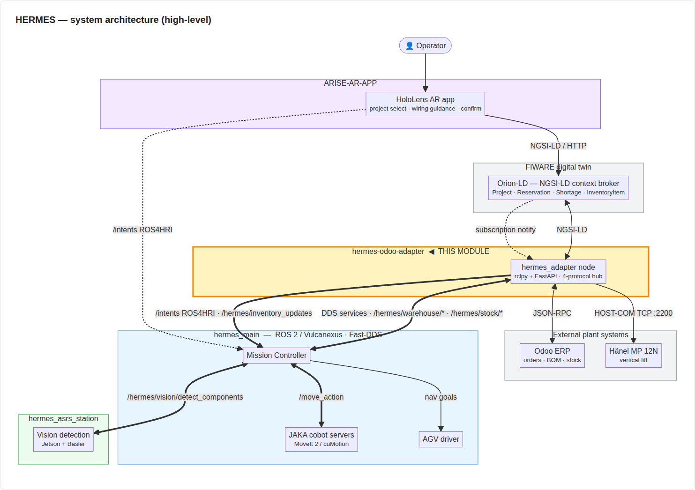

# 05 — Role in a robotics + ERP cell

> **Audience:** an integrator weighing whether the adapter fits a
> similar deployment.
> **Reading time:** 5 minutes.

This page connects the **open shareable module** (the HERMES Odoo
Adapter) to the **full robotics assembly cell** it was built for.
It says, concretely:

1. Where the adapter sits in the cell.
2. What the open module reproduces vs. what stays cell-specific.
3. What evidence supports the integration claim.

## System overview

High-level view of the whole system — the ROS 2 nodes, the key topics /
services, the middleware layers (ROS 2 / Fast-DDS, NGSI-LD, JSON-RPC,
HOST-COM), the operator interaction flow, and the module boundaries
(this adapter highlighted):



## The cell at a glance

The full cell is a custom **electrical-panel assembly cell**
deployed in the Ampero / Olorin lab. The cell takes a customer order
from Odoo, retrieves the right components from a Hänel vertical lift,
sequences cobot picks + AGV deliveries, and guides the operator through
the manual wiring step via a HoloLens AR app.

| Sub-system | Hardware | Software |
|---|---|---|
| ASRS picking + assembly handover | 2× JAKA Pro 16 cobots | MoveIt 2 + custom Mission Controller (in `hermes_main/`) |
| Component storage | Hänel MP 12N vertical lift | HOST-COM TCP telegrams |
| Inter-cell shuttling | XBOT wireless AGV (433 MHz / RS485) | Custom driver + nav2 docking |
| Component detection | Basler 4K USB3 camera + Jetson Orin | DINOv2 + grabcut detection (`hermes_asrs_station/`) |
| Operator UI | HoloLens 2 + StereoKit/OpenXR | `ARISE-AR-APP` (StereoKit C#) + `panelserver` (Flask) |
| ERP | Odoo 17 | Standard Odoo manufacturing + custom HERMES addon |
| Digital twin | Orion-LD + Mongo | NGSI-LD entities owned by the adapter |
| **Integration backbone** | — | **This module (the Odoo Adapter)** |

## Where the adapter sits

```
                         ┌────────────────────────┐
                         │  HoloLens AR operator  │
                         │  (Ampero / panelserver)│
                         └───────────┬────────────┘
                                     │ HTTP NGSI-LD
                                     ▼
   ┌─────────┐    JSON-RPC  ┌────────────────────────────────┐  NGSI-LD   ┌──────────┐
   │  Odoo   │◄────────────►│  HERMES Odoo Adapter (this)    │◄──────────►│ Orion-LD │
   │   ERP   │              │  rclpy + FastAPI + zeep        │            │  + Mongo │
   └─────────┘              │                                 │            └────┬─────┘
                            │  /hermes/warehouse/...           │                 │
                            │  /hermes/stock/...               │                 │
                            │  /hermes/inventory_updates       │                 │
                            │  /hermes/mission_state (sub)     │                 │
                            └────────┬───────────────┬────────┘                 │
                                     │ DDS           │ SOAP 1.1                  │
                                     ▼               ▼                           │
                            ┌────────────────┐   ┌────────────┐                  │
                            │ Mission        │   │  Hänel MP  │                  │
                            │ Controller     │   │  HOST-COM  │                  │
                            │  + MoveIt2     │   └────────────┘                  │
                            └────┬──┬────────┘                                   │
                                 │  │                                            │
                                 │  └───────── ROS 2 DDS ─────────► JAKA / AGV / camera
                                 │
                                 └── ROS 2 DDS ──► HoloLens AR bridge ──────────►┘
```

End-to-end run (single project, one BOM line):

1. Planner creates a manufacturing order in Odoo.
2. Adapter polls Odoo, creates `Project` + `Reservation` in Orion-LD.
3. HoloLens AR app picks the project up from Orion and shows the operator
   the kit list; operator confirms "Start".
4. Mission Controller calls `/hermes/warehouse/pick` → adapter calls
   Hänel HOST-COM → tray presented at the pickup point.
5. JAKA #1 picks the component → places on the AGV.
6. AGV docks at the assembly cell.
7. JAKA #2 picks from the AGV → places on the assembly fixture.
8. HoloLens guides operator through wiring; operator confirms placement.
9. Mission Controller calls `/hermes/stock/consume` → adapter updates
   Odoo + Orion + emits `/hermes/inventory_updates`.
10. Repeat 4-9 for the next BOM line.
11. After all picks: `/hermes/stock/produce` + `Project.status = completed`.

## Open module ↔ cell mapping

| Cell component | Reusable module extraction | What stays cell-specific |
|---|---|---|
| **Odoo integration** | `OdooClient` + JSON-RPC patterns + the BOM-resolution worker | The Odoo addon and customer BOM data |
| **Orion-LD digital twin** | `OrionClient` + the four entity schemas + the `@context` + subscription handler | Operator dashboard configuration |
| **Hänel integration** | `WarehouseClient` ABC + `HanelHostComClient` (open; raw TCP HOST-COM telegrams, default) + `HanelSoapClient` (open; legacy HOST-WEB SOAP 1.1) + the `NullWarehouseClient` mock | Live Hänel endpoint + credentials |
| **ROS 2 / DDS face** | `HermesAdapterNode` — 5 services + 4 publishers (`/hermes/inventory_updates`, `/hermes/warehouse/tray_state`, `/diagnostics`, `/intents`) + 1 subscriber | The Mission Controller that consumes them (lives in `hermes_main/`) |
| **NGSI-LD ↔ DDS bridging** | In-process bridging in `ros2_node.py` ↔ `orion_client.py`; canonical mapping in [`config/README.md`](../config/README.md) | — |
| **ROS4HRI Intent publishing** | Planner-derived MO intent published from the adapter on `/intents`. Operator-side intents stay in `hermes_main/` companions. | The HoloLens AR-button → Intent companion node still lives in `hermes_main/hololens_api/` (out of this repo's scope). |
| Mission Controller / MoveIt 2 / cuMotion | Not part of the open module | Internal to `hermes_main/` |
| Vision detection (Jetson) | Not part of the open module | Internal to `hermes_asrs_station/` |
| HoloLens AR app | Not part of the open module | `ARISE-AR-APP/` + `panelserver/` |
| AGV driver | Not part of the open module | `hermes_main/agv/` |

The open module **reproduces** the integration backbone: ERP ↔ FIWARE ↔
DDS ↔ vertical lift. It deliberately does not include the cobot motion
planning, the vision detection, the AGV driver, or the AR app — each of
those is its own concern and reusing the adapter does not require
reusing them.

## What the in-repo demo reproduces

The [`04_basic_demo_how_to_use.md`](04_basic_demo_how_to_use.md) demo
exercises the integration backbone with the same code as the full
cell, but:

- The Hänel vertical lift is replaced by `NullWarehouseClient`.
- The Odoo ERP is replaced by `docker/odoo-mock/`.
- The Mission Controller is replaced by manual `ros2 service call`s.
- The HoloLens AR app is replaced by manual `curl` against Orion-LD.

This is a reproducible research artefact, not the full industrial cell.

## Evidence

| Evidence | Status | Link |
|---|---|---|
| Recorded demo | ✅ [`../media/demo.gif`](../media/demo.gif) (asciinema source at [`../media/demo.cast`](../media/demo.cast)) | — |
| Architecture diagram | ✅ [`../media/architecture_diagram.md`](../media/architecture_diagram.md) (Mermaid, renders inline on GitHub) | — |
| Sequence diagrams | ✅ [`../media/sequence_diagram.md`](../media/sequence_diagram.md) — three Mermaid sequence diagrams covering Project → Shortage, top-up → Reservation, and Mission Controller → ConsumeStock | — |
| Execution logs | ✅ [`../media/screenshots/01-09_*.log`](../media/screenshots/) — captured from a fresh-clone reproducibility run | The Intent publishing is at [`../media/screenshots/05_intent_published.log`](../media/screenshots/05_intent_published.log) |
| Latency metrics | ✅ Captured at [`../media/screenshots/08_metrics.log`](../media/screenshots/08_metrics.log) (Prometheus output) + [`../media/screenshots/11_grafana_system_health.png`](../media/screenshots/11_grafana_system_health.png) (Grafana live render) | — |

## Limitations

- The open module exercises the integration path; **it does not include
  the cobot motion logic or the vision detection** — those are necessary
  for the cell to physically pick a component but are independent
  reusable modules outside this one.
- The Hänel HOST-COM client is tested only against the MP 12N controller
  in the assembly cell. Other Hänel models or other vendors require a
  fresh `WarehouseClient` implementation.
- The trigger this module ships is the Odoo manufacturing-order →
  ROS4HRI Intent path; a HoloLens AR-button → Intent trigger is a
  straightforward future addition on the same `/intents` contract.
- The adapter has not yet been validated under cross-network DDS
  conditions (Discovery Server / Easy Mode); production deployments
  today are single-host.

## Next reading

- [`02_interfaces.md`](02_interfaces.md) — the canonical reference for
  reusing the adapter against your own Mission Controller / digital twin.
