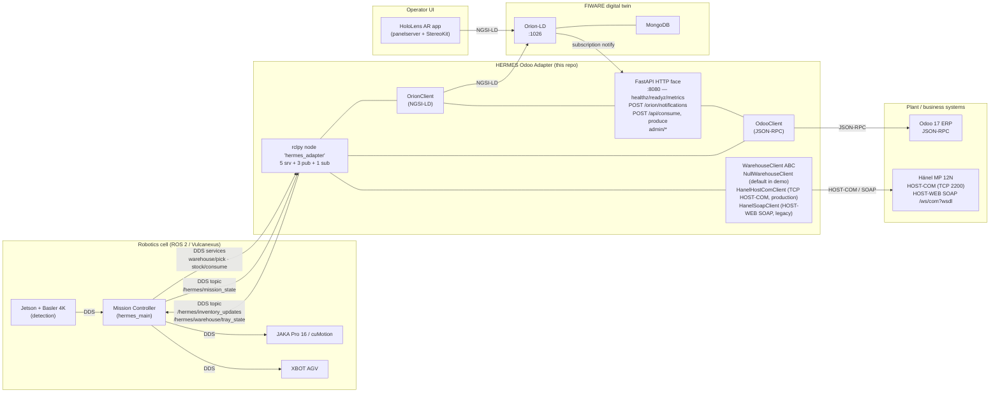

# HERMES Odoo Adapter — architecture diagram

The diagram below renders inline on GitHub. The source is Mermaid (text);
edit this file and the rendering updates.

## Reading the diagram

- **The adapter is the only hop between business systems (Odoo + Hänel)
  and the robotics / digital-twin world.** Everything else either talks
  ROS 2 (Mission Controller, cobot, AGV, vision) or NGSI-LD (HoloLens AR
  app via the operator panel) — only the adapter speaks both, plus
  Odoo JSON-RPC and Hänel HOST-COM / SOAP.
- The Mission Controller calls ROS 2 services on the adapter
  (`/hermes/warehouse/pick`, `/hermes/stock/consume`, …) and publishes
  `mission_state` for the adapter to mirror into Orion-LD.
- Orion-LD posts subscription notifications back into the FastAPI face
  whenever a new `Project` is created.

A static ASCII version of the same diagram lives at the top of
[`../docs/01_arise_context.md`](../docs/01_arise_context.md) for tools
that don't render Mermaid.

A simpler component-list diagram and the full topic / entity / service
inventory are in [`../docs/02_interfaces.md`](../docs/02_interfaces.md).
