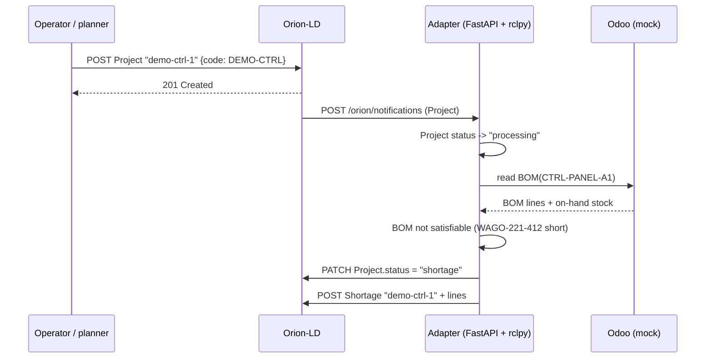
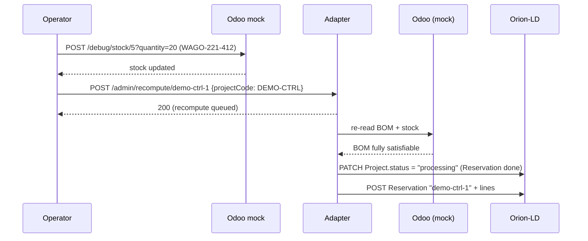
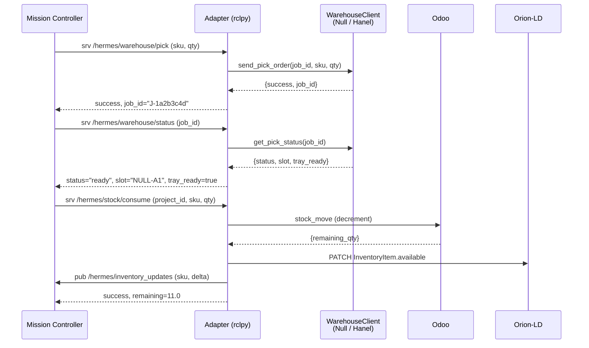

# HERMES Odoo Adapter — sequence diagrams

Three flows the adapter mediates. Mermaid renders inline on GitHub.

## Flow 1 — Project → Shortage (default mock data)

This is the path the in-repo demo exercises by default (see
[`../docs/04_basic_demo_how_to_use.md`](../docs/04_basic_demo_how_to_use.md)
Stage 1). The mock seed is intentionally short on `WAGO-221-412` so the
adapter takes the shortage branch.

## Flow 2 — top up stock → Reservation

After the operator (or a maintenance job) tops up the short SKU, the
recompute endpoint re-runs the BOM resolution.

## Flow 3 — Mission Controller pick → ConsumeStock

This is the steady-state DDS-side conversation the adapter is built for
(see [`../docs/04_basic_demo_how_to_use.md`](../docs/04_basic_demo_how_to_use.md)
Stages 2-3).

For the ROS4HRI `Intent` publisher flow (planned for Sprint 0.4 — see
[`../docs/D4_PLAN.md`](../docs/D4_PLAN.md) §4.4), the sequence will live
alongside this file once the implementation lands.
