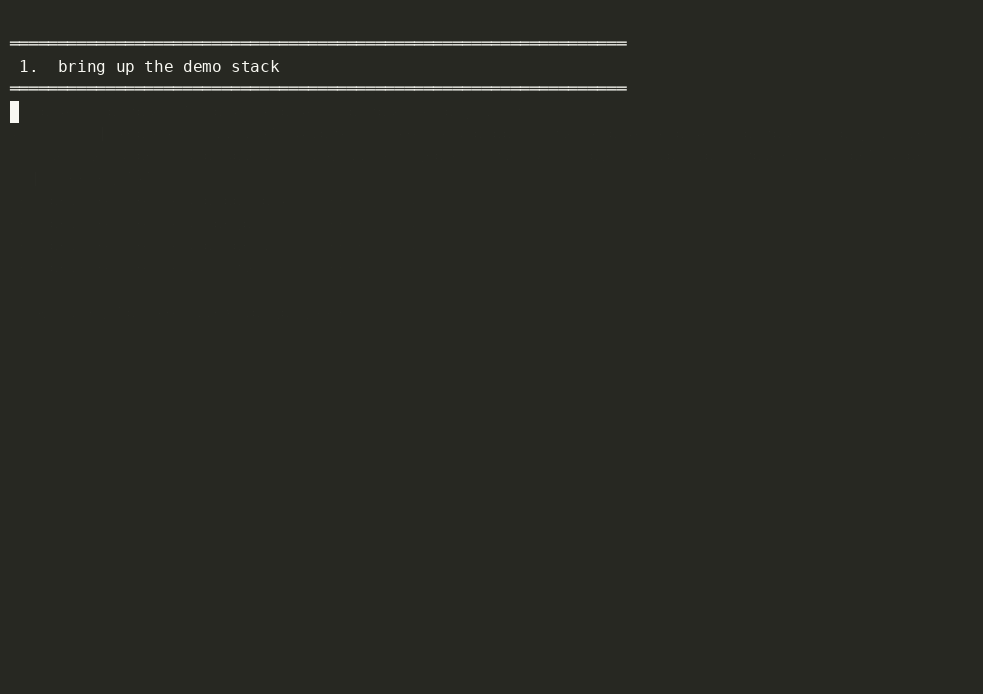

# Demonstrator video

## TRL6-7 demonstrator video (the canonical D4 "demonstrator video")

[**TBD — paste D3 video URL here**]

This is the same URL that was submitted as the D3 / Milestone 3
TRL6-7 demonstrator evidence; D4 §3.4.1 explicitly reuses it under
"Previous milestones and deliverables". The D4 written report goes
into every "Demonstrator video" cell — `§3.1` (Project identification
sheet), `§3.3.8` (Role in the demonstrator), `§3.3.9` (Validation),
`§3.4.1` (Annex I) and `§3.4.2` (Annex IV) — and they all link the
same recording.

> The D4 docx is explicit (§2): *"The deliverable in the final
> milestone is **just an incremental contribution** to the previous
> deliverables."* The cell-running video isn't re-recorded for D4;
> it's reused.

## Short open-module demo clip — shipped

A recorded run of the in-repo **mock-only** demo flow that complements
the live-cell TRL6-7 video. A reviewer can watch the full Quick-Start
(`docs/03_installation_and_hello_world.md` →
`docs/04_basic_demo_how_to_use.md`) without watching the long-form
demonstrator video first.



- **`demo.gif`** — the rendered clip (~14 s). Renders inline on GitHub
  above, and can be embedded directly in the written report / `.docx`.
- **`demo.cast`** — the source [asciinema](https://asciinema.org)
  recording. Play locally with `asciinema play media/demo.cast`, or
  `asciinema upload media/demo.cast` to publish a clickable
  asciinema.org URL for an online/PDF report.

The GIF was produced from the cast with
[`agg`](https://github.com/asciinema/agg):
`agg --speed 2 --idle-time-limit 1 --theme monokai media/demo.cast media/demo.gif`.

### What the clip shows

### Acceptance criteria for the short clip

1. (~10 s) Show a fresh `git clone https://github.com/Ampero-SRL/hermes-odoo-adapter` + `cd hermes-odoo-adapter`.
2. (~5 s)  `cp .env.example .env`.
3. (~15 s) `docker compose -f docker/docker-compose.demo.yml up -d` + wait for `/healthz` (use `until curl -sf … ; do sleep 1; done`).
4. (~10 s) `curl -s http://localhost:8080/healthz | jq .` → green output.
5. (~10 s) `curl -sS -i -H "Content-Type: application/ld+json" -X POST http://localhost:1026/ngsi-ld/v1/entities -d @examples/payloads/project.json` → `HTTP/1.1 201 Created`.
6. (~15 s) Trigger the recompute: `curl -sX POST http://localhost:8080/admin/recompute/demo-ctrl-1 -H "Content-Type: application/json" -d '{"projectCode":"DEMO-CTRL"}'` → `queued`.
7. (~10 s) `docker compose ... logs adapter --since=10s | grep "Published ROS4HRI Intent"` → the Sprint-0.4 Intent line.
8. (~15 s) `bash examples/curl/04_list_entities.sh Shortage | jq` → the `Shortage:demo-ctrl-1` entity.

Total runtime: ~90 seconds (the implicit waits dominate).

### Recording it

A self-contained script lives at
[`../scripts/demo_walkthrough.sh`](../scripts/demo_walkthrough.sh) that
prints each command + waits between steps so a recorder can capture
the eight beats above at a readable pace.

The two simplest recording paths:

```bash
# (a) asciinema cast — text terminal recording, plays back on a web
#     page or in any modern terminal:
sudo apt install -y asciinema
asciinema rec --command "bash scripts/demo_walkthrough.sh" demo.cast
# upload to asciinema.org → paste the URL below.

# (b) vhs tape — GIF/MP4 generated headlessly from a tape file:
go install github.com/charmbracelet/vhs@latest
vhs scripts/demo_walkthrough.tape   # produces demo.gif
```

A pre-made `vhs` tape file is shipped at
[`../scripts/demo_walkthrough.tape`](../scripts/demo_walkthrough.tape).

### Hosting

- YouTube (unlisted) is acceptable; embed the link here once recorded.
- For long-term stability (the D4 submission tag must remain stable
  until **2033-06-30**, six years after ARISE ends), prefer a Zenodo /
  institutional repository deposit as the canonical archival URL,
  with the YouTube link as the day-to-day accessible mirror.

### URL placeholders

| Asset | URL |
|---|---|
| D3 TRL6-7 demonstrator video (canonical for D4) | [TBD: paste D3 video URL] |
| Optional short open-module demo clip — local asciinema cast | ✅ [`demo.cast`](demo.cast) (captured 2026-06-11; 50+ frames over ~30 s of demo flow). Play locally with `asciinema play media/demo.cast` (`pip install --user asciinema`) or upload to asciinema.org for a shareable URL. |
| Optional short open-module demo clip — asciinema.org URL | [TBD: `asciinema upload media/demo.cast` to publish + paste the URL] |
| Zenodo / archival mirror | [TBD] |

## Screenshot derivatives

While the video is being prepared, capture per-stage screenshots into
[`screenshots/`](screenshots/) — see that directory's `README.md` for
the shot list.
